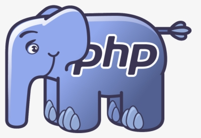
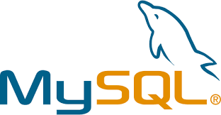
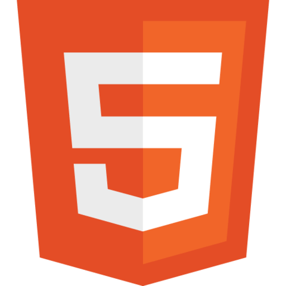

# Hi there 👋, I'm Arthur!

I am **Software Engineer** from Russia, I love to code and solve interesting tasks. For me **programming** is more that just a job. I like to learn through **practice** rather than learning from lectures. I prefer to **experiment and try** than to think and procrastinate about my tasks. 

## ✨ Current **Stack**
1. PHP (Laravel)
2. Go (Gin, Fasthttp)
3. Javascript
4. MySQL, PostgreSQL, MongoDB (learning)
5. HTML + CSS (SCSS)

## :wrench: Languages and Tools

 
 
 
 
   
## :blue_book: **Principles** of Software Development

- [x] **DRY**
- [x] **KISS**
- [x] **YAGNI**
- [x] **SOLID**

## 📬 Get in **touch**
- *LinkedIn:* <a href="https://www.linkedin.com/in/arthur-shafikov-5bab70233/" target="_blank">Arthur Shafikov</a>
- *Email:* volchonock27@gmail.com
